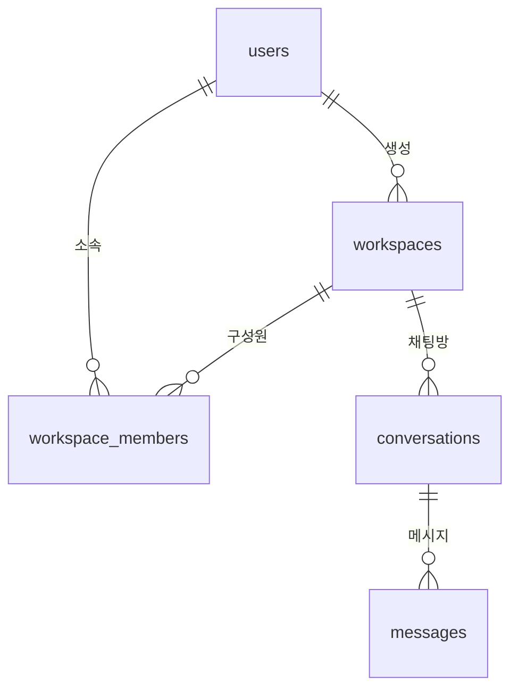

# ADR 0002: 사용자·작업 공간·채팅 데이터 구조

날짜: 2026-09-09\
상태: 채택\
범위: `todo.md` PR 2 — 핵심 5개 테이블, 저장·조회 계층, 실제 PostgreSQL 검증

## 목적과 범위

PR 1의 DB 연결 기반 위에 사용자, 작업 공간, 소속 관계, 채팅방과 메시지를 저장할 구조를 추가한다. 기존 채팅 화면과 HTTP API에 저장 기능을 연결하는 작업은 이후에 진행한다. 새 공개 API와 로그인 기능은 이 변경에 포함하지 않는다.

`DATABASE_ENABLED=false` 기본값과 기존 Mock 실행 방식을 유지한다. ORM 모델과 저장·조회 코드는 서버 내부에서만 사용한다. 인증된 사용자를 결정하는 API 의존성과 PostgreSQL RLS는 PR 3의 범위다.

## 테이블과 관계

| 테이블              | 주요 내용                                                                                          |
| ------------------- | -------------------------------------------------------------------------------------------------- |
| `users`             | 정규화된 이메일, 표시 이름, 계정 상태, 마지막 로그인 시각                                          |
| `workspaces`        | 작업 공간 이름, 생성자와 상태                                                                      |
| `workspace_members` | 사용자와 작업 공간의 소속 관계, `owner/admin/member` 역할                                          |
| `conversations`     | 작업 공간, 생성자, 제목, 모델과 JSON 설정, 보관·고정·삭제 상태, 마지막 활동 시각, 다음 메시지 순번 |
| `messages`          | 작업 공간과 채팅방, 순번, 역할, 본문, 생성 상태, 작성자, 토큰 수와 모델·프롬프트 버전              |

모든 도메인 기본 키는 UUID이고, 날짜는 `timestamptz`로 저장하며 DB 연결의 시간대는 UTC다. 생성·수정 시각에는 DB 기본값을 두며 수정 시각 갱신은 ORM과 저장·조회 코드가 담당한다. 직접 SQL로 수정하는 작업은 필요한 시각도 함께 갱신해야 한다.

이메일은 앞뒤 공백을 제거하고 소문자로 정규화한다. 저장소의 유일 제약이 동시 요청의 중복까지 차단한다. DB에도 정규화 형태·길이·기본 주소 형식 검사를 둔다. 이메일 확인과 실제 수신 가능 여부 검증은 가입 기능에서 구현한다.

`(workspace_id, user_id)` 소속 관계와 `(conversation_id, sequence)` 메시지 순번은 각각 유일해야 한다. 메시지의 `(workspace_id, conversation_id)`는 채팅방의 같은 두 열을 참조하는 복합 외래 키다. 작업 공간과 다른 채팅방을 조합한 메시지는 DB에서도 거부한다.

상태·역할·양수 순번·음수가 아닌 토큰 수·비어 있지 않은 완료 메시지·설정 JSON 객체를 제약조건으로 검증한다. 사용자 메시지는 작성자와 완료 상태를 요구하고, 서버가 작성하는 assistant/system 메시지는 사용자 작성자를 기록하지 않는다.

## 저장·조회 계층과 접근 범위

서버 내부 호출자가 신뢰할 수 있는 사용자 ID를 전달한다. 작업 공간과 대화·메시지의 조회 및 변경은 활성 사용자, 활성 작업 공간과 소속 관계를 확인한다. 다른 작업 공간의 객체 ID만 알아서는 해당 객체를 조회하거나 변경할 수 없다. 작업 공간 구성원은 같은 공간의 대화를 공유하며, 대화 삭제는 생성자 또는 공간의 owner/admin만 수행한다.

이 검사는 인증 자체를 구현한 것이 아니다. PR 3에서 로그인 세션으로 사용자 ID를 결정한 뒤 저장·조회 계층에 전달해야 한다. 브라우저가 보낸 사용자 ID를 그대로 신뢰하는 공개 API를 만들지 않는다. DB 직접 접속에 대한 RLS 보호도 PR 3에서 추가한다.

사용자·기본 작업 공간·owner 소속 관계는 하나의 호출자 트랜잭션 안에서 생성한다. 저장·조회 코드는 입력 검증과 `flush()`를 수행하고 `commit()`을 호출하지 않는다. 호출자가 전체 작업을 성공시켰을 때만 커밋한다. DB 오류가 발생하면 호출자는 계속 같은 트랜잭션을 쓰지 않고 롤백한다.

오류와 운영 로그에는 이메일·메시지 본문·모델 설정·SQL 인자·인증정보를 담지 않는다. 저장·조회 작업 이름, 결과, 소요시간과 내부 식별자 등 허용한 필드만 기록한다.

## 목록 순서와 메시지 동시성

대화 목록은 작업 공간·상태·삭제 여부로 범위를 제한하고 `(last_message_at DESC, id DESC)` 순서로 커서를 적용한다. 해당 순서의 인덱스는 삭제되지 않은 행만 포함한다. 메시지가 없는 채팅방도 목록에 나타나도록 `last_message_at`은 처음에는 생성 시각으로 초기화한다.

메시지 목록은 대화 내 순번을 기준으로 이전 페이지를 조회하고, 반환된 페이지 안에서는 오래된 메시지부터 정렬한다. 실제 API용 커서 계약과 화면의 무한 스크롤은 후속 작업에서 연결한다. 커서는 읽기 시점의 순서를 나타내며 여러 요청에 걸친 DB 스냅샷을 고정하지 않는다.

메시지 추가 시 채팅방 행을 원자적으로 갱신해 `next_message_sequence`에서 순번을 확보한다. 순번 갱신, 메시지 저장과 마지막 활동 시각 갱신은 같은 짧은 트랜잭션에 속한다. 실패 후 롤백하면 순번 할당도 취소된다. 다른 트랜잭션의 같은 행 변경이 직렬화되는 PostgreSQL의 잠금 동작을 이용한다. [PostgreSQL 행 잠금](https://www.postgresql.org/docs/17/explicit-locking.html#LOCKING-ROWS)

## 삭제와 데이터 보존

대화 삭제는 `deleted_at`을 기록하는 소프트 삭제다. 일반 대화·메시지 조회에서는 제외하지만 본문을 즉시 지우지 않는다. 유예기간과 자동 영구 삭제 작업은 후속 단계에서 정한다.

작업 공간을 DB에서 영구 삭제하면 소속 관계·대화·메시지가 함께 삭제된다. 대화를 영구 삭제하면 메시지도 삭제된다. 사용자가 작성한 작업 공간·대화·메시지가 남아 있을 때 사용자 삭제는 외래 키로 제한한다. 향후 계정 삭제 작업은 소유권 이전 또는 데이터 삭제 순서를 명시적으로 처리해야 한다. 현재 저장·조회 계층에는 범용 영구 삭제 API를 제공하지 않는다.

## 마이그레이션과 검증

`0002_core_chat_schema`는 기존 `0001_database_baseline` 위에 적용한다. 테이블 생성은 Alembic으로만 수행하며 앱 시작 때 `create_all()`이나 자동 마이그레이션을 실행하지 않는다. Alembic은 모델 메타데이터를 불러와 실제 테이블·열·인덱스·기본값과의 차이를 검사한다. 자동 비교가 모든 CHECK 제약 변경을 검출하는 것은 아니므로 제약은 실제 DB 오류를 유발하는 통합 테스트로도 확인한다. [Alembic 자동 비교의 범위](https://alembic.sqlalchemy.org/en/latest/autogenerate.html)

`.venv/bin/python scripts/test_db.py`는 개발 DB와 분리된 임시 PostgreSQL에서 마이그레이션 왕복, 스키마 비교와 전체 백엔드 테스트를 실행한다. 저장·조회, 중복과 잘못된 외래 키, 작업 공간 접근 범위, 트랜잭션 롤백, 동시 순번 할당, 커서 목록과 삭제 정책을 검증한다.

## 롤백과 후속 작업

앱의 DB 사용을 중단하려면 `DATABASE_ENABLED=false`로 다시 시작한다. 테이블은 보존한 채 이전 코드로 돌아갈 수 있다. PR 1의 엄격한 스키마 비교는 추가된 테이블을 차이로 보고하므로 PR 1에서 `alembic check`를 통과시키기 위해 데이터를 지우지 않는다.

`0002_core_chat_schema`를 다운그레이드하면 핵심 5개 테이블과 그 안의 데이터가 삭제된다. 자동 다운그레이드 검증은 버릴 수 있는 테스트 DB에서만 실행한다. 실제 데이터가 생긴 로컬 DB에서는 백업과 복구 계획 없이 다운그레이드하지 않는다. 이번 작업의 로컬 DB 적용은 업그레이드만 수행한다.

인증 수단·세션 테이블은 PR 3, 생성 작업·이벤트는 PR 5~6, 요약은 PR 8에서 구체적인 사용 흐름과 함께 추가한다. 아직 없는 테이블을 참조하는 외래 키를 미리 만들지 않는다. 이 변경만으로 기존 화면의 대화가 자동 저장되거나 새로고침 후 복원되지는 않는다.
