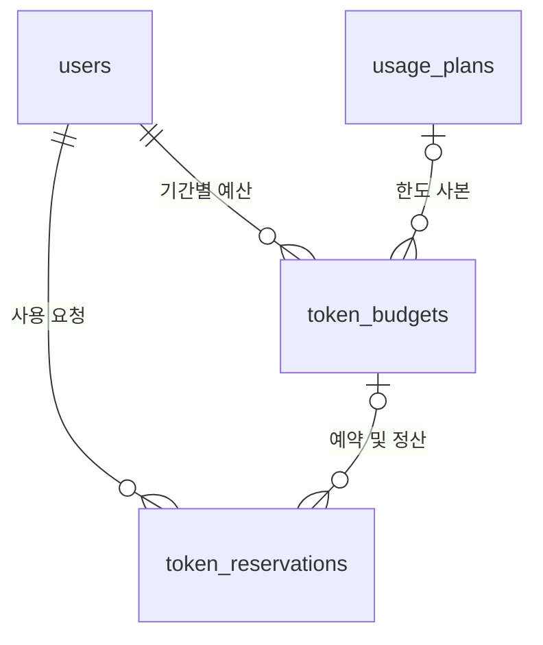

# ADR 0003: 시스템 계정과 결제로 확장할 토큰 예산

날짜: 2026-09-09\
상태: 채택\
범위: 사용자 권한 구분, 토큰 플랜·기간 예산·예약/정산, 로컬 관리 명령

**후속 변경:** 새 생성 요청의 사전 예약은 [ADR 0008](0008-deferred-charging-and-chat-scroll.md)의 종료 후 차감으로 대체한다. 아래 예약 서비스는 기존 이력과 이전 요청의 처리를 위해 유지한다.

## 제품 방향

운영자의 `system` 계정은 서비스가 부과하는 누적 토큰 한도를 면제한다. 일반 계정은 플랜에 따른 기간 예산을 사용하며 향후 결제 확인이 같은 발급 구조에 연결된다. [ADR 0007](0007-monthly-allowances.md)에서 무료 월 20,000토큰·한국 시간 매월 1일 갱신·미이월 정책을 확정했다. 결제사와 유료 가격은 후속이며 기존 관리 명령은 로컬 유지보수용으로 남긴다.

`system`의 무제한은 사용량에 따른 차단을 면제한다는 뜻이다. 모델의 컨텍스트 길이, 한 번의 생성 길이, 메모리, 동시 실행 수와 장애 방지 제한은 별도의 기술적 제약이다. 기존 `max_tokens` 옵션을 무한대로 바꾸지 않는다. 시스템 계정도 실제 사용량을 기록한다.

## 서로 다른 세 종류의 역할

| 구분                | 값                                                | 용도                                          |
| ------------------- | ------------------------------------------------- | --------------------------------------------- |
| 서비스 계정 권한    | `users.platform_role = member / system`           | 일반 사용자와 플랫폼 운영자, 사용량 한도 면제 |
| 작업 공간 소속 권한 | `workspace_members.role = owner / admin / member` | 해당 작업 공간의 공유 데이터 접근             |
| 모델 메시지 역할    | `messages.role = system / user / assistant`       | 모델 입력의 대화 형식                         |

세 값은 서로 독립적이다. 표시 이름이나 이메일에 `system`이 들어가거나 작업 공간의 owner라고 해서 시스템 계정이 되지 않는다. 시스템 계정은 PostgreSQL의 superuser와도 관계없다. 운영 권한이 생겨도 다른 사용자의 원문 대화에 접근하는 기존 작업 공간 검사를 건너뛰지 않는다.

기존 사용자와 일반 생성 경로의 기본 역할은 항상 `member`다. 로컬 운영자가 명시적으로 실행하는 초기화 명령만 시스템 계정을 생성하거나 승격한다. 앱 시작, 이메일 일치, 공개 회원가입에서 자동 승격하지 않는다. 인증 기능을 추가할 때 이미 준비한 시스템 계정에 대한 비밀번호 설정은 검증된 별도 초기화 절차로 연결해야 하며, 동일 이메일을 제출한 가입자가 소유권을 얻어서는 안 된다. [OWASP 접근 권한 원칙](https://cheatsheetseries.owasp.org/cheatsheets/Authorization_Cheat_Sheet.html)

## 데이터 구조

기존 5개 테이블을 보존하고 `0003_system_token_quotas`에서 사용자 권한 열과 다음 3개 테이블을 추가한다.

| 테이블               | 책임                                                                                         |
| -------------------- | -------------------------------------------------------------------------------------------- |
| `usage_plans`        | 플랜 코드·이름·기본 토큰량·사용 가능 상태. 금액과 결제 상태는 저장하지 않음                  |
| `token_budgets`      | 사용자별 시작·종료 시각, 해당 기간의 한도 사본, 사용·예약 토큰, 원본 플랜, 중복 부여 방지 키 |
| `token_reservations` | 사용자별 요청 키, 예약량, 실제 입력·출력 토큰, 정산 상태, 한도 면제 여부와 원래 예산         |

한도는 사용자 단위다. 같은 사용자가 여러 작업 공간을 만들어도 예산이 늘어나지 않는다. 향후 기업용 공동 결제가 필요할 때 별도 결제 계정과 비용 귀속 규칙을 추가하며, 현재의 작업 공간 권한을 과금 권한으로 재사용하지 않는다.

플랜의 기본량은 예산을 만들 때 복사한다. 플랜을 바꾸더라도 이미 발급한 기간의 한도와 사용량을 재설정하지 않는다. 기간은 UTC의 `[시작, 종료)`로 저장하고 사용자 행을 잠근 후 중복을 검사한다. `0006_monthly_allowances`부터 같은 사용자·source 안의 기간 중복을 거부하며, 무료 `free_monthly`와 별도 `plan` 기간은 겹칠 수 있다. plan이 유효하면 무료와 합산하지 않고 해당 예산만 사용한다. 직접 SQL로 이 규칙을 우회하는 예산 수정은 지원하지 않는다.

일반 사용자에게는 월 무료 예산을 가입·사용량 조회·생성 승인 시 자동 준비한다. plan이 있으면 이를 우선하며 소진돼도 기간 종료 전 무료로 전환하지 않는다. 선택한 예산이 부족하면 생성 예약을 거부한다. 월 지급은 시스템 계정의 수동 할당을 요구하지 않는다.

## 생성 전 예약과 완료 후 정산

1. 신뢰된 서버가 완성된 모델 입력의 토큰 수와 최대 출력량을 계산한다. 사용자 요청의 숫자를 사용량의 근거로 삼지 않는다.
2. 생성 전에 `reserve()`를 호출하고 짧은 트랜잭션을 커밋한다. 일반 사용자는 `한도 - 사용량 - 예약량`이 요청량 이상이어야 한다. 시스템 계정은 예산 없이 면제 예약을 기록한다.
3. DB 트랜잭션을 닫은 상태에서 모델을 실행한다.
4. 입력·출력 청구량과 산정 기준을 `settle()`로 기록하고 사용하지 않은 예약량을 돌려준다. 생성하지 않은 요청은 `release()`로 전부 해제한다. 정상 완료·실사용이 확인된 실패는 최종 실제량을 정산하며, 사용자 중지는 아래의 확인 수신량 할인 정책을 적용한다.

입력은 새 질문 외에 서버가 다시 전달한 대화 이력·시스템 지침 등 전체 모델 입력을 포함한다. 정상 출력은 모델의 최종 실제 사용량을 기준으로 하며 생각 토큰도 포함한다. 현재 문자 수로 토큰을 추정하거나 실제 결제를 청구하지 않는다.

**취소 정책 수정(2026-09-09):** [ADR 0006](0006-persistent-chat-and-usage.md)의 빠른 중지는 모델 응답 연결을 닫고, 최종 사용량이 없을 때 서버가 `logprobs`로 확인한 출력이 1개 이상이면 전체 입력과 확인한 출력만 정산한다. 확인한 출력이 없으면 입력·출력 청구량을 0으로 면제한다. 미수신 GPU 사용량은 추정 청구하지 않는다. `0007_cancellation_usage`의 `usage_basis`는 최종 실제량 `provider`, 확인 수신량 `received`, 면제 `waived`를 구분한다. 반환은 `waived`, 미정산 예약은 NULL이다.

`reserve()`와 최종 정산은 사용자별 요청 키로 멱등성을 보장한다. 같은 키와 같은 내용의 재시도는 기존 결과를 반환하며, 충돌하는 내용은 거부한다. 정산은 입력·출력과 `usage_basis`가 모두 같아야 한다. 이미 끝난 예약도 기존 상태로 반환하고 새 예약량을 부여하지 않는다. 반환 성공은 모델을 다시 실행해도 된다는 뜻이 아니다. 아직 `reserved`인 요청도 이미 실행 중일 수 있으므로 생성 작업 단계에서 요청 키와 작업의 유일성을 연결하고 worker의 실행 소유권을 별도로 확보해야 한다. 예산 부여 키도 고유하며 정규화한 요청의 해시로 동일한 요청인지 확인한다. 추후 결제 이벤트 ID를 부여 키로 연결할 수 있다.

동시 예약은 같은 사용자·예산의 행 잠금으로 한도를 초과하지 않게 한다. 각 동시 작업은 독립된 DB 세션을 사용한다. [PostgreSQL 행 잠금](https://www.postgresql.org/docs/17/explicit-locking.html#LOCKING-ROWS), [SQLAlchemy 비동기 세션](https://docs.sqlalchemy.org/en/20/orm/extensions/asyncio.html#using-asyncsession-with-concurrent-tasks)

기간이 만료되거나 역할이 바뀌어도 이미 시작한 요청은 예약 당시의 예산과 면제 여부로 정산한다. 비활성 계정의 새 예약은 차단하지만, 서버 내부에서 기존 요청을 마무리하는 정산은 허용한다. 실제 사용량이 예약량보다 크면 정산을 거부하고 예약을 유지한다. provider/tokenizer 오류를 수정해 재정산해야 하며, 실패를 이유로 무조건 전액 반환하지 않는다.

자동 만료만으로 예약을 해제하지 않는다. 실행 중인 worker의 예약을 풀면 같은 예산을 중복 사용할 수 있다. worker 복구·취소·최종 정산은 생성 작업 단계에서 예약 키와 연결하며, 회수 시 실행 종료를 먼저 확인한다.

## 구현 경계와 다음 순서

이 ADR 도입 당시 범위는 내부 서비스와 로컬 관리 명령이었다. 이후 ADR 0005·0006에서 로그인·세션·메시지 저장·실제 tokenizer와 생성 사용량 정산을 연결했고, ADR 0007에서 월 무료 자동 지급을 추가했다. 사용자·권한은 검증된 세션에서만 결정한다. 실제 결제 연동은 후속이다.

결제 단계에는 별도 고객·구독·결제 이벤트 테이블, 서명 검증, 이벤트 중복 처리, 취소·환불 정책을 구현한다. 검증된 결제 이벤트로만 기간 예산을 발급하고 사용량 기록을 삭제하거나 덮어쓰지 않는다. 결제사의 상태와 사용 가능 토큰 잔액을 하나의 열로 섞지 않는다.

## 검증과 롤백

실제 PostgreSQL에서 기존 데이터 보존, 기본 일반 권한, 시스템 한도 면제, 사용량 기록, 관리자 권한, 기간 경계, 중복 요청, 동시 예약, 정산·취소·롤백, 예산 간 사용자 외래 키를 검증한다. 로컬 DB에는 업그레이드만 적용한다.

`0003`의 다운그레이드는 3개 토큰 테이블과 사용자 권한 정보를 삭제한다. `0002`의 사용자·대화 데이터는 남지만 모든 시스템 역할과 예산·사용량 이력이 사라지므로 실제 사용 DB에는 자동으로 실행하지 않는다. 되돌릴 때는 데이터를 보존하고 이전 앱 코드를 사용하며, 엄격한 스키마 비교가 차이를 보고할 수 있음을 고려한다.
